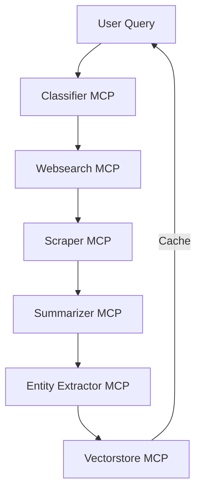

# Orchestrator MCP

## Overview

The **Orchestrator MCP** is the central pipeline controller for the Accountability Plus platform. It coordinates the flow of data through all other MCP microservices (Classifier, Websearch, Scraper, Summarizer, Entity Extractor, Vectorstore), handling query processing, error management, and observability. The orchestrator enables seamless, modular, and scalable multi-step content analysis and retrieval workflows.

---

## How It Works

1. **Cache Probe:** Checks the vectorstore for a cached result for the input query. If found, returns the cached vector ID.
2. **Classifier:** Sends the query to the classifier MCP to extract tags and categories.
3. **Websearch:** Uses classifier output to search for relevant articles via the websearch MCP.
4. **Scraper:** Extracts main article text from URLs using the scraper MCP.
5. **Summarizer:** Merges and summarizes the scraped text using the summarizer MCP.
6. **Entity Extractor:** Extracts structured entities from the summary using the entity extractor MCP.
7. **Vectorstore:** Aggregates all results and stores them (with embeddings) in the vectorstore MCP for future semantic search and retrieval.

Each step is modular and can be retried or replaced independently.

---

## Endpoints

### `/process` (POST)

- **Description:** Orchestrates the full pipeline for a given query.
- **Request:**
  ```json
  { "query": "Las Vegas mass shooting 2017" }
  ```
- **Response:**
  ```json
  {
    "cached": false,
    "vector_id": "...",
    "summary_text": "...",
    "entity_output": { ... }
  }
  ```
  If a cached result is found, returns `{ "cached": true, "vector_id": "..." }`.

### `/healthz` (GET)

- **Description:** Health check endpoint.
- **Response:** `{ "ok": true }`

### `/metrics` (GET)

- **Description:** Exposes Prometheus metrics for monitoring pipeline latency and failures.

---

## Pipeline Flow



---

## Monitoring & Observability

- **Prometheus metrics** are exposed on port 9000, tracking latency and failures for each MCP call.
- Each pipeline step is timed and errors are counted for robust monitoring.

---

## Notes

- The orchestrator is fully async and uses `aiohttp` for non-blocking HTTP calls to all MCPs.
- Adapters are used to convert between the output of one MCP and the input of the next, ensuring loose coupling.
- The orchestrator is stateless and horizontally scalable.
- For more details on deployment or integration, see the main project README or contact the maintainers.
